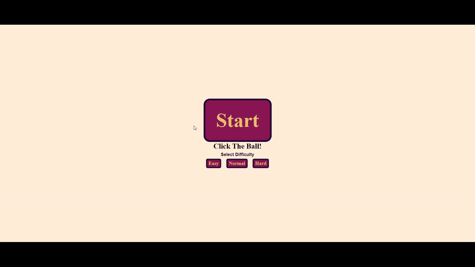

# Pop The Ball Game

The 'Pop The Ball' game has been created using basic HTML, CSS, and vanilla JavaScript knowledge. In this game, players try to reduce the health of escaping the ball by clicking on them. The scores are kept in local storage.

## Live Site
You can reach live website link at [Pop The Ball](https://poptheball.netlify.app/)

## Site Preview

